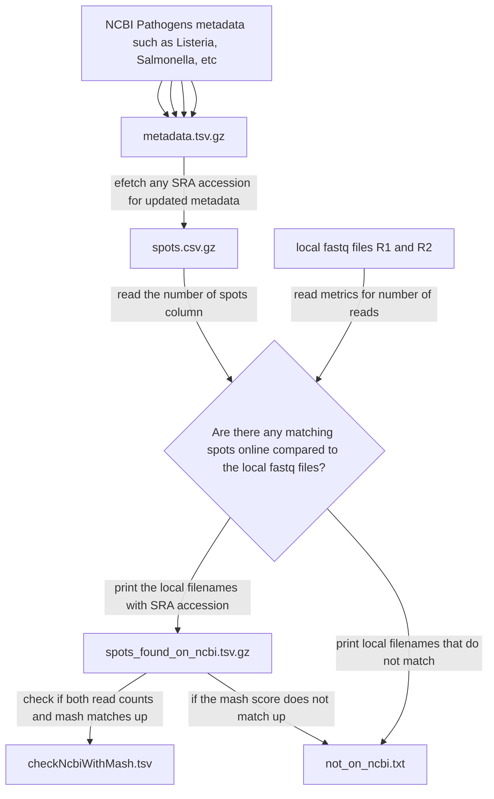

# adapting ../README.md to all

## diagram



## notes

```bash
# Get all metadata from the Listeria NCBI Pathogens
cat ~/GWA/projects/SneakerNet/ncbiPathogens/data/ftp.ncbi.nlm.nih.gov/pathogen/Results/*/latest_snps/Metadata/*.metadata.tsv | sort | gzip -c9 > 2024-12-09.metadata.tsv.gz
# extract any SRA run ID
zcat 2024-12-09.metadata.tsv.gz | perl -lane 'while(/([DES]R[RS]\d+)/g){print $1;}' > SRA_run.txt
# Get the number of spots per SRA ID
mkdir chunks
(
    cd chunks
    # Create 999 files from the SRA_run.txt accessions file
    split --additional-suffix=.srr -l $((3750766 / 999)) ../SRA_run.txt 
    \ls *.srr | xargs -P 4 -n 1 bash -c 'echo $0; efetch -input $0 -db SRA > $0.csv 2> $0.csv.log'
    sort *.csv | uniq | gzip -c9 > ../SRR.csv.gz
)
#nohup efetch -input SRA_run.txt -db SRA > SRR.csv 2> SRR.csv.log &
# Make a two column file with SRR identifier and number of spots
# Create gz file to help with disk I/O times when searching later
zcat SRR.csv.gz | perl -F, -lane '
  $spots=$F[3];
  $SRR=undef;
  for my $i(24,5..23,25..30){
    if($F[$i] =~ /([SED]R[SR]\d{4,})/){
        $SRR = $1;
    }
  }
  next if(!$SRR);
  next if($spots < 10); # ignore very low counts
  print join("\t", $spots, $SRR);
' | sort -nr | gzip -9c > spots.csv.gz
```

Now check the directory against the number of reads

```bash
dir=testData
# I had to run chmod to make sure I could do this analysis on everything
# fd '\.fastq\.gz$' /mnt/CalculationEngineReads.test/ | xargs -n 100 -P 8 chmod -v 664
fd '_R1_.*\.fastq.gz|_1.fastq.gz$' $dir | xargs -P 4 -n 1 bash -c '
    R1=$0
    R2=${R1/_1.fastq.gz/_2.fastq.gz}
    R2=${R2/_R1_/_R2_}

    echo "Looking at $R1 and $R2 ..."

    # get the number of spots in the local fastq 
    numReads=$(zcat $R1 $R2 | fasten_metrics | tail -n 1 | cut -f 2)
    if [[ "$numReads" -lt 1000 ]]; then
      echo "NOTE: numReads for $R1 $R2 is fewer than 1000" >&2
      echo -e "$R1\t$R2" >> not_on_ncbi.txt
      exit
    fi

    SRS=$(zgrep $(($numReads/2)) spots.csv.gz | cut -f2 -d, | sort -n | uniq)

    # Even though only one SRS is expected, more could be found and so loop through them
    # If the SRS is found, then mark for later verification
    (
        for srs_acc in $SRS; do
            echo -e "$srs_acc\t$R1\t$R2"
        done
    ) | gzip -9c >> spots_found_on_ncbi.txt.gz;
    # If the SRS is not found, then it is at least not found in NCBI Pathogens and so
    # mark it for safe keeping
    (
        if [ ! "$SRS" ]; then
            echo -e "$R1\t$R2"
        fi
    ) >> not_on_ncbi.txt
'
```

Recompress but also ignore results that happen a ton of times

```bash
# Some results seem to be duplicated a ton and so let's mostly ignore them
zcat spots_found_on_ncbi.txt.gz | perl -lane '
  next if($F[1]++ > 10); 
  print;
' > spots_found_on_ncbi.txt && \
  gzip -fv9 spots_found_on_ncbi.txt
```

```bash
# TODO download fastq from NCBI and compare against local fastq file
# To recap: not_on_ncbi.txt represents reads not already on NCBI for sure, but
# spots_found_on_ncbi.txt represents reads that _might_ be on NCBI.
# We need to verify the reads from spots_found_on_ncbi.txt and either:
#   * (not verified) add these reads to not_on_ncbi.txt 
#   * or, (verified) add these reads to a new file found_on_ncbi.txt
mashThreshold=0.95
k=32
stackSize=10000
parentTempdir="fasterq-dump"
zcat spots_found_on_ncbi.txt.gz | shuf | xargs -P 4 -L 1 bash -c '
  SRS=$0
  localR1=$1
  localR2=$2
  if [[ $(stat -c%s "$localR1") -lt 1000 || $(stat -c%s "$localR2") -lt 1000 ]]; then
    echo "Error: One or both files are smaller than 1000 bytes." >&2
    ls -lhL $localR1 $localR2 >&2
    exit 0
  fi

  echo "$R1 $R2" >&2

  perl ../scripts/checkLocalVsNcbiWithMash.pl --R1 $localR1 --R2 $localR2 --SRS $SRS
' > checkNcbiWithMash.tsv
```
